# 📊 SƠ ĐỒ PLANTUML - HỆ THỐNG TUYỂN DỤNG NHÂN SỰ

File này chứa code PlantUML ngắn gọn cho tất cả các sơ đồ chính. Copy code vào [PlantUML Online Editor](http://www.plantuml.com/plantuml/uml/) để xem sơ đồ.

---

## 1. USE CASE DIAGRAM - TỔNG QUAN

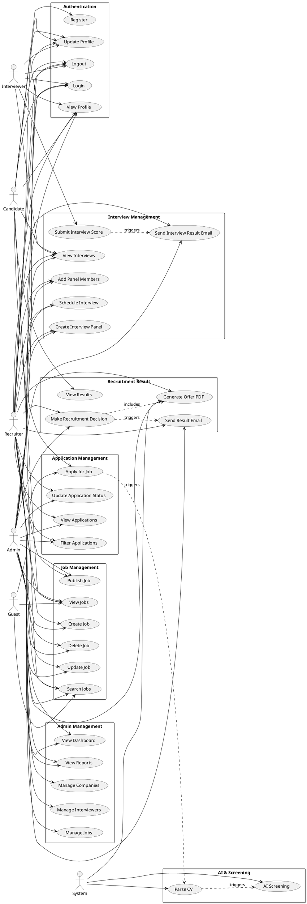

---

## 2. USE CASE DIAGRAM - CHI TIẾT THEO ACTOR

### 2.1. Candidate Use Cases

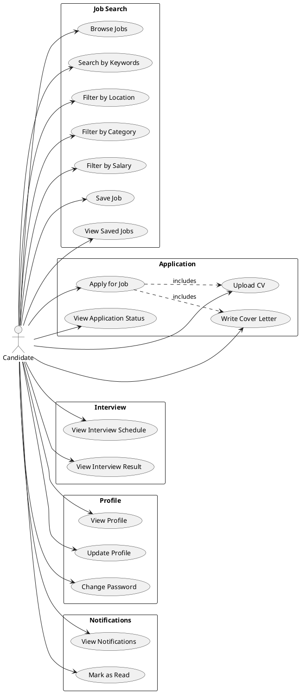

### 2.2. Recruiter Use Cases

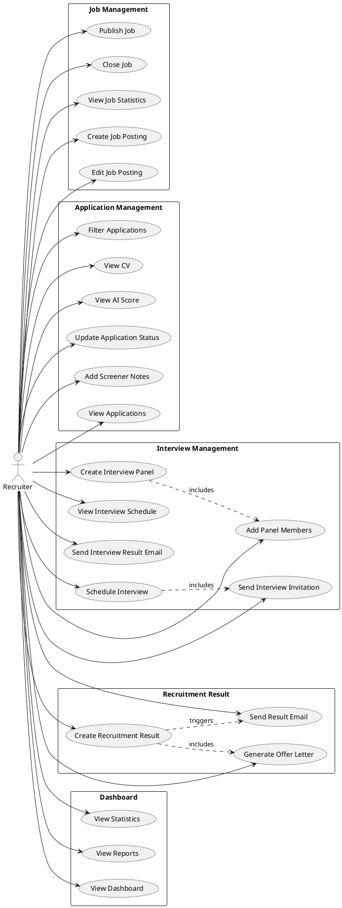

### 2.3. Interviewer Use Cases

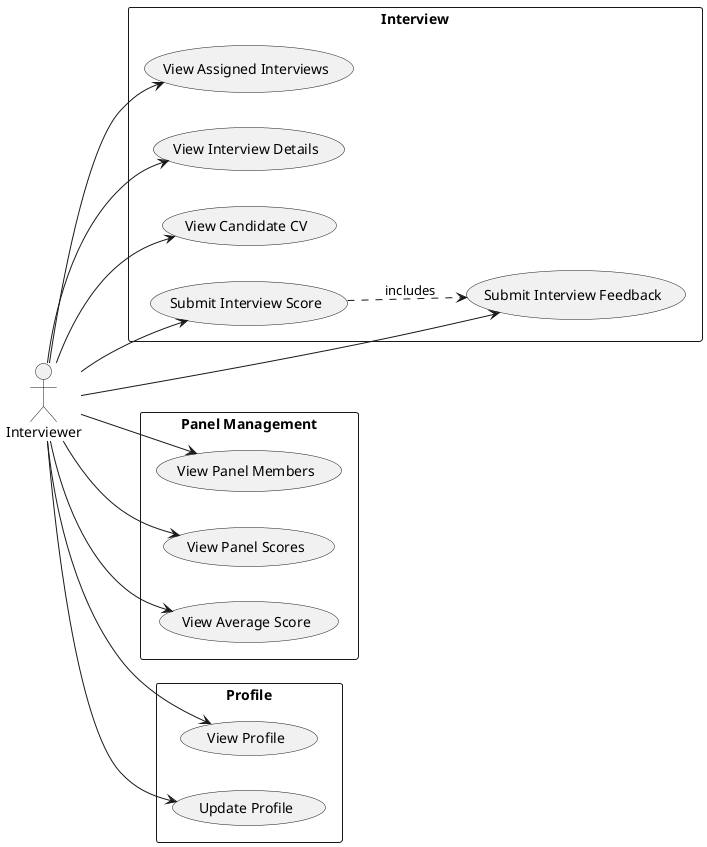

### 2.4. Admin Use Cases

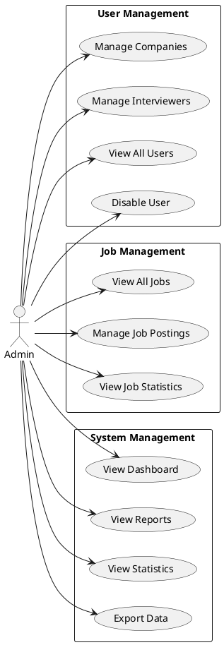

---

## 3. ACTIVITY DIAGRAM - ĐĂNG KÝ & ĐĂNG NHẬP

### 3.1. Đăng ký (Register)

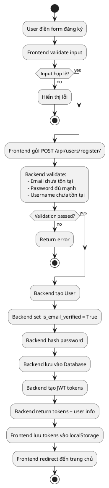

### 3.2. Đăng nhập (Login)

```plantuml
@startuml
start
:User nhập email & password;
:Frontend gửi POST /api/users/login/;
:Backend tìm user theo email;
if (User tồn tại?) then (no)
  :Return error: "Email không tồn tại";
  stop
else (yes)
endif

:Backend verify password;
if (Password đúng?) then (no)
  :Return error: "Mật khẩu sai";
  stop
else (yes)
endif

:Backend set is_email_verified = True;
:Backend tạo JWT tokens;
:Backend return tokens + user info;
:Frontend lưu tokens vào localStorage;
if (Role = CANDIDATE?) then (yes)
  :Redirect đến /careers;
else (Role = RECRUITER/ADMIN?)
  :Redirect đến /dashboard;
else (Role = INTERVIEWER?)
  :Redirect đến /interviews;
endif
stop
@enduml
```

---

## 4. ACTIVITY DIAGRAM - ỨNG VIÊN GỬI CV

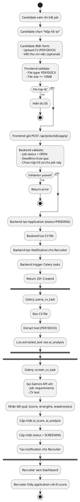

---

## 5. ACTIVITY DIAGRAM - LUỒNG HOẠT ĐỘNG NHÀ TUYỂN DỤNG

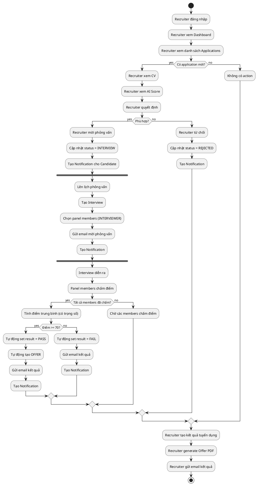

---

## 6. ACTIVITY DIAGRAM - LUỒNG HOẠT ĐỘNG ADMIN

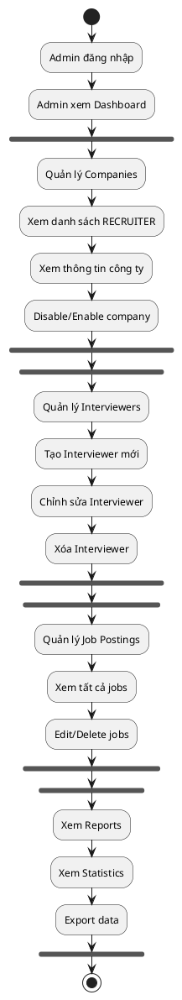

---

## 7. SEQUENCE DIAGRAM - ĐĂNG KÝ & ĐĂNG NHẬP

### 7.1. Đăng ký

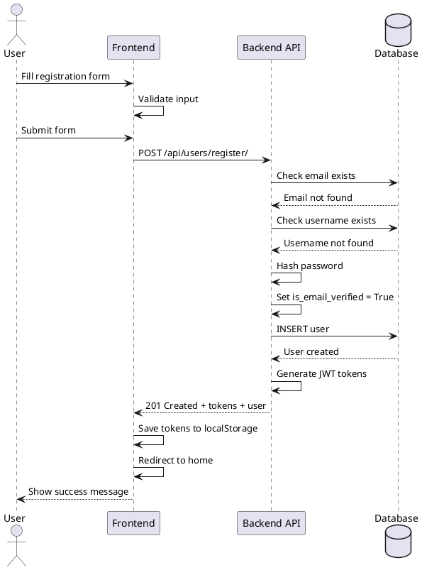

### 7.2. Đăng nhập

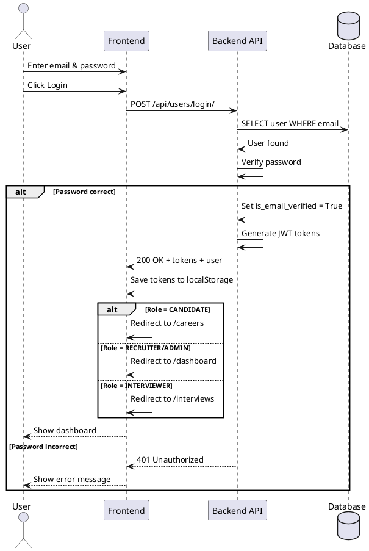

---

## 8. SEQUENCE DIAGRAM - ỨNG VIÊN GỬI CV

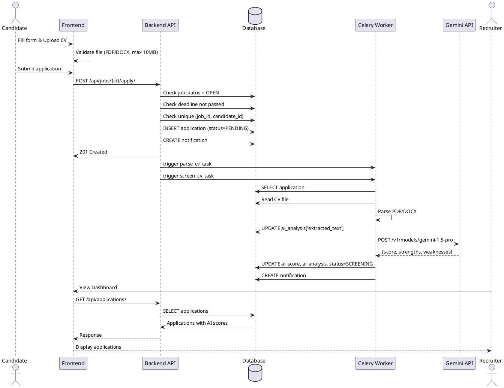

---

## 9. SEQUENCE DIAGRAM - PHỎNG VẤN VỚI HỘI ĐỒNG

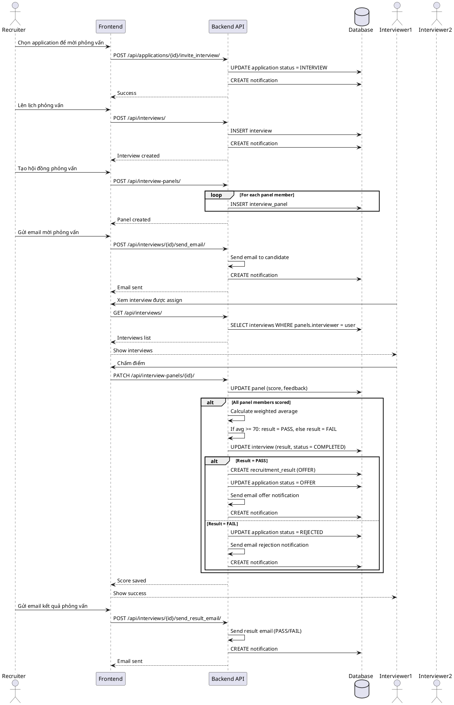

---

## 10. SEQUENCE DIAGRAM - GỬI EMAIL KẾT QUẢ PHỎNG VẤN

```plantuml
@startuml
actor Recruiter
participant Frontend
participant "Backend API" as API
database Database
cloud "Email Service" as Email

Recruiter -> Frontend: Chọn interview có kết quả
Recruiter -> Frontend: Click "Gửi email & thông báo kết quả"
Frontend -> Frontend: Confirm action
Frontend -> API: POST /api/interviews/{id}/send_result_email/

API -> Database: SELECT interview
Database --> API: Interview with result (PASS/FAIL)

alt Interview result = PASS
  API -> API: Load template: interview_result_pass.html
  API -> API: Prepare context (candidate, job, feedback)
  API -> Email: Send email (subject: "Chúc mừng! Bạn đã vượt qua...")
  Email --> API: Email sent
  API -> Database: CREATE notification (title: "Chúc mừng! Bạn đã vượt qua...")
else Interview result = FAIL
  API -> API: Load template: interview_result_fail.html
  API -> API: Prepare context (candidate, job, feedback)
  API -> Email: Send email (subject: "Kết quả phỏng vấn...")
  Email --> API: Email sent
  API -> Database: CREATE notification (title: "Kết quả phỏng vấn...")
end

API --> Frontend: 200 OK + message
Frontend --> Recruiter: Show success message

actor Candidate
Candidate -> Frontend: Check email
Candidate -> Frontend: View notifications
Frontend -> API: GET /api/notifications/
API -> Database: SELECT notifications WHERE user = candidate
Database --> API: Notifications list
API --> Frontend: Notifications
Frontend --> Candidate: Show notification
@enduml
```

---

## 11. COMPONENT DIAGRAM - PHÂN RÃ CHỨC NĂNG

```plantuml
@startuml
package "Frontend (React)" {
  [React App] as Frontend
  [Candidate UI]
  [Recruiter UI]
  [Interviewer UI]
  [Admin UI]
  [Auth Service]
  [API Service]
}

package "Backend (Django REST)" {
  [Django REST API] as API
  [User Service]
  [Job Service]
  [Application Service]
  [Interview Service]
  [Interview Panel Service]
  [Result Service]
  [Notification Service]
  [Email Service]
}

package "Background Jobs (Celery)" {
  [Celery Worker] as Worker
  [CV Parser]
  [AI Screening]
  [Email Sender]
}

database "PostgreSQL" as DB

cloud "External Services" {
  [Gemini API] as Gemini
  [SMTP Server] as SMTP
}

Frontend --> API : HTTP/REST
API --> DB : ORM
API --> Worker : Task Queue
Worker --> DB : ORM
Worker --> Gemini : HTTP API
Email Service --> SMTP : SMTP
Worker --> Email Service : Send emails

@enduml
```

---

## 12. DEPLOYMENT DIAGRAM - KIẾN TRÚC TỔNG QUAN

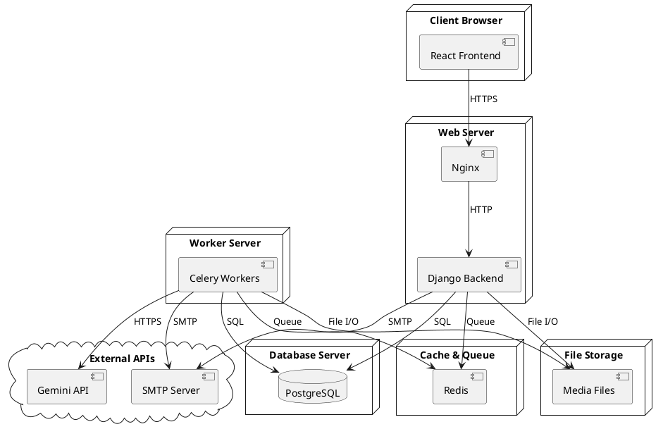

---

## 13. CLASS DIAGRAM

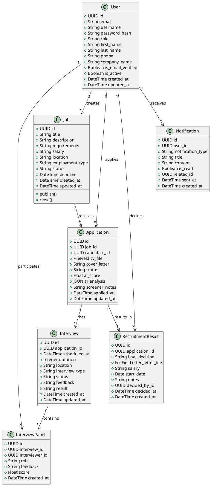

---

## 14. STATE DIAGRAM - APPLICATION STATUS

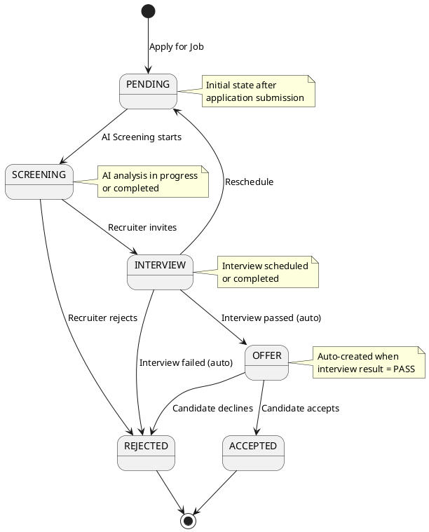

---

## 📝 GHI CHÚ

- ✅ Tất cả sơ đồ đã **BỎ** email verification và OTP
- ✅ Authentication chỉ còn: **Register** và **Login** với username/password
- ✅ User đăng ký xong có thể đăng nhập ngay (không cần verify)
- ✅ Đã thêm chức năng **Hội đồng phỏng vấn** với chấm điểm tự động
- ✅ Đã thêm **Gửi email kết quả phỏng vấn** (PASS/FAIL)
- ✅ Đã thêm **Tự động tạo OFFER** khi interview result = PASS
- ✅ Đã thêm **Quản lý Interviewers** (Admin)
- ✅ Đã thêm **Tính điểm trung bình có trọng số** (LEAD = 1.5, MEMBER = 1.0)
- 📄 Copy code vào [PlantUML Online](http://www.plantuml.com/plantuml/uml/) để xem sơ đồ

---

## 🛠️ CÁCH SỬ DỤNG

1. Mở [PlantUML Online Editor](http://www.plantuml.com/plantuml/uml/)
2. Copy code từ bất kỳ sơ đồ nào ở trên
3. Paste vào editor
4. Click "Submit" để xem sơ đồ
5. Export PNG/SVG nếu cần

---

## 📚 TÀI LIỆU THAM KHẢO

- Chi tiết đầy đủ: `TONG-HOP-MO-TA-SO-DO.md`
- Use Cases: `docs/05-use-cases-and-bfd.md`
- Architecture: `docs/06-architecture-diagrams.md`
